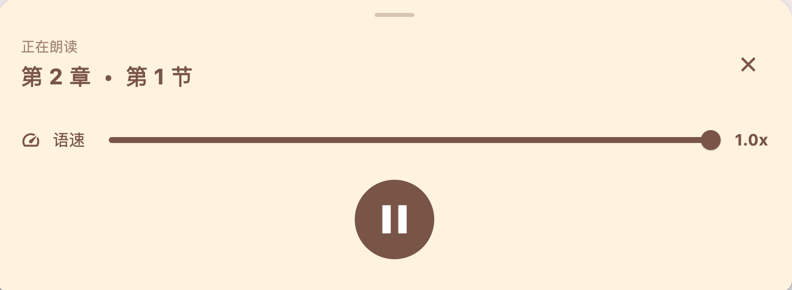
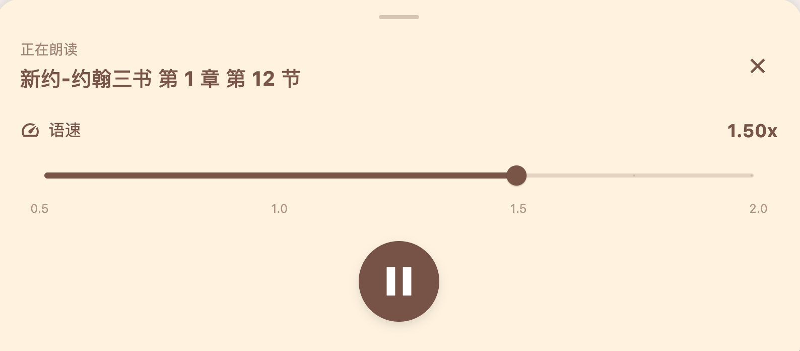
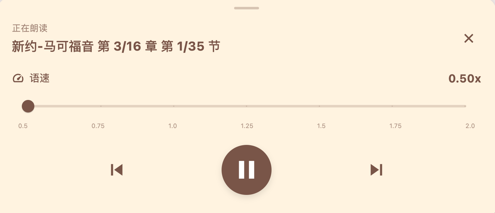

# 1

1，为什么文本是繁体的？我想用简体的。
2，对于导航，现在上面是英文，下面是中文。我想全部用中文，还有，中文的第一个字要放大，突出“大字有声圣经”的大。
3，将对语音包的要求写入 README

 iOS 模拟器有时是“哑巴”的。请在模拟器里打开： Settings -> Accessibility -> Spoken Content -> Voices -> Chinese。
有时候语音选项是关闭的，要先打开Spoken Content

如果有语音包但没下载 (云符号)，请点击下载 (模拟器下载可能较慢)。
如果没有中文选项，说明此模拟器镜像被阉割了语音包。

4，在 ios 版本中，机械语音引擎读了节数字号。在 macos 中，语音引擎也读了数字。有没有办法不读这个节数字号？在人工朗读版本中，是没有这个节数字的。

5，能不能把章的分类加在导航上？在data/新旧约章名.md里，有一些关于章的划分，例如律法书、历史书，我想将这些分类放在章与章之间，做一些分割，这样导航也不至于显得太单调。

6，在应用中，打开之后，有一个“恩言大字版”，改为“大字有声圣经”。

# 2

据说信徒是新约、旧约分开看的，而且一般都是优先看新约。所以，在顶部加一个标签导航，并且把“旧约”和“新约”的顺序调换一下，把“新约”放在前面。这样，打开应用，默认就是新约。

还有，右上角怎么有一人 debug 标签，这是调试阶段才有，还是正式版本也有？它挡住了它后面的设置按钮，我不希望有。

# 3

底部的播放控制器，需要优化：

1，右上角的速率切换后，播放速率没有变化，需要有变化，而不是重新播放才有变化；
2，中间只需要有一个暂停按钮，负责播放、暂停，不需要有两个按钮；
3，在这个播放控制器上，是不是可以直观地显示当前播放的是哪一章、哪一节，播放了多少了？请你进行适用于老年人的最优设计；
4，在播放的时候，节的内容，没有跟着滚动，不能直观地看到当前播放到哪一节了。请你进行适用于老年人的最优设计；
5，当播放哪一节的时候，当前节应该有高亮显示，请你进行适用于老年人的最优设计；

# 4

1，语速速率切换后，播放速率没有变化，需要有变化，而不是重新播放才有变化；
2，速率的显示条，要有明显的标记，标出当前选中的速率；还有，大于 1.0x的速度也要有。例如 1.25x, 1.5x, 1.75x, 2.0x 等；
3，左上角的章节信息，缺少卷，例如图示章了，应该显示“新约-马太福音第 2 章第 1 节”；

# 5

1,速度条中，0.5 与 1.0 之间再加一个 0.75x 的标记；其它类似。

2，你知道每卷有多少章，每章有多少节吗，在“新约-约翰三书 第 1章 第 12 节”中，能否变成“新约-约翰三书 第 1/n章 第 12/m 节”，其中 n 是当前卷的总章数，m 是当前章的总节数。

3，两个小优化：当播放第1 章后，只要用户没有停止，就继续播放第 2 章……直到最后 1 章播放完，再播放下一卷。还有，当双击节的时候，就从这里播放。

4，我们的播放逻辑需要重新梳理一下。 可能前面有些地方没有考虑周全，不应该删除播放器上的两个按钮。

# 6

1，上一章、下一章、播放/暂停按钮，能否在下面各放一个说明文字：上一章、下一章、播放/暂停？

2,你的 0.5 是原本的正常语速吗？我以为 1.0 是正常语速。

3，中间的播放/暂停按钮，在播放器弹出时，单击可以控制暂停，再单击却不能继续播放。

4，我经过思考确认：播放器与卷章节是一体的，播放器的暂停、播放，应该影响到当前卷章节的显示；切换卷章节，也应该影响到播放器的暂停、播放。卷章节的位置在哪里，就从哪里播放。

5，我觉得语速的控制并不重要，将语速的控制放在“设置”页面内。在播放控制器上，不显示语速控制了。让播放控制器更简单，更直观，更低一些，能更多显示上面的文字内容。

6，还有，当关闭播放控制器时，如果没有点暂停，就不能停，手机锁屏也不能停。要能后台播放。